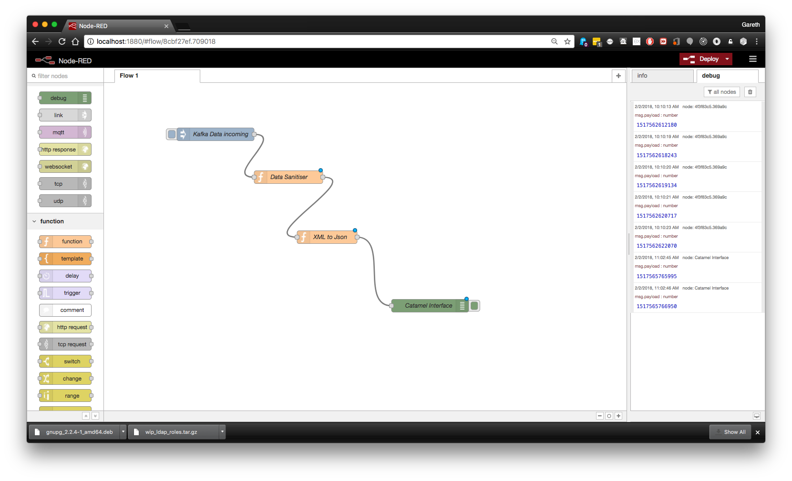

### Kubernetes @ DMSC

Gareth Murphy

ESS DMSC

2018-02-05

---

### What is Kubernetes

- Kubernetes is an open-source system for automating deployment, scaling, and management of containerized applications.
- https://kubernetes.io/
- KubeCon in Cph https://events.linuxfoundation.org/events/kubecon-cloudnativecon-europe-2018/

---

### What do we want to deploy?

- SciCat Data Catalogue
- Make ESS metadata available to users
- Easily findable, accessible
- Open source - https://github.com/ScicatProject

---
### SciCat is not a single app

- Database (MongoDB)
- Web frontend (catanie - Angular based)
- Data catalogue backend (catamel- Automatically generated using loopback)
- Message/job queuing system (currently RabbitMQ -> migrating to Kafka)
- Dataflow interface (Node-Red)

---

### Kubernetes Deployment

- Minikube
- For local testing only
- Working minikube config at github.com/ScicatProject/localdeploy
- RBAC disabled by default - can renable

---

### MongoDB

- Database requires persistent storage
- Currently we store on k8s nodes, not a longterm solution

---?image=assets/catanie2.png&size=auto 90%

---

### Node-RED

### Catamel

---?image=assets/catamel.png&size=auto 90%

---

## MongoDB

---

## Helm

- Package manager for Kubernetes
- Equivalent of apt or yum
- Prepackaged k8s deployments available

