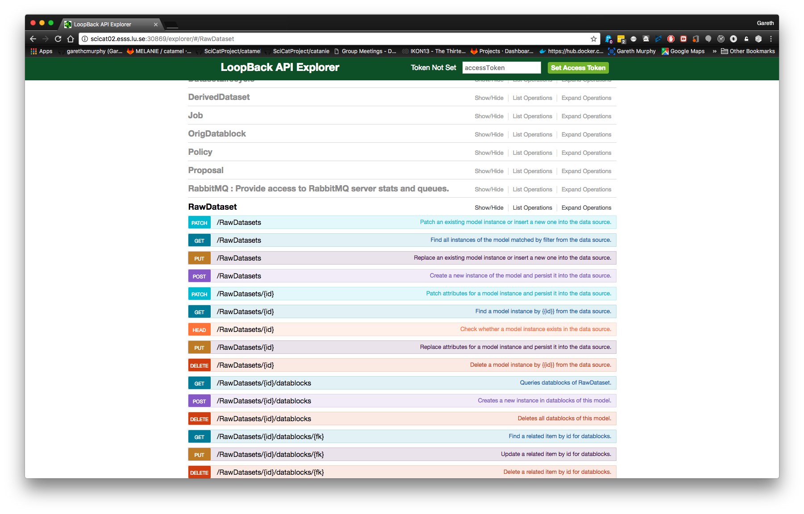
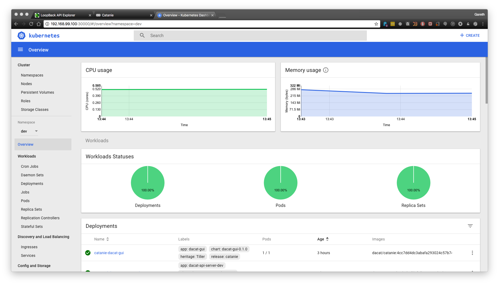
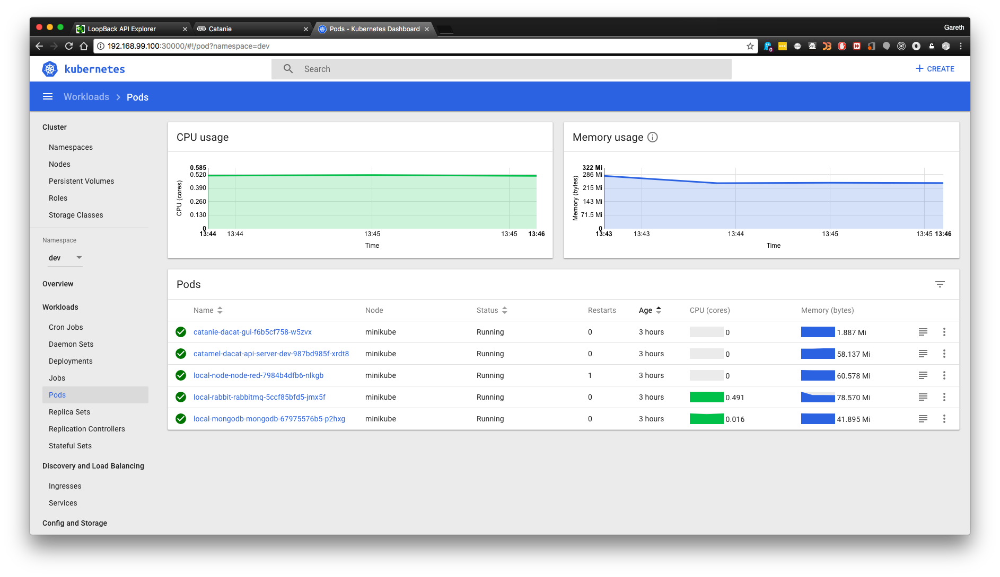
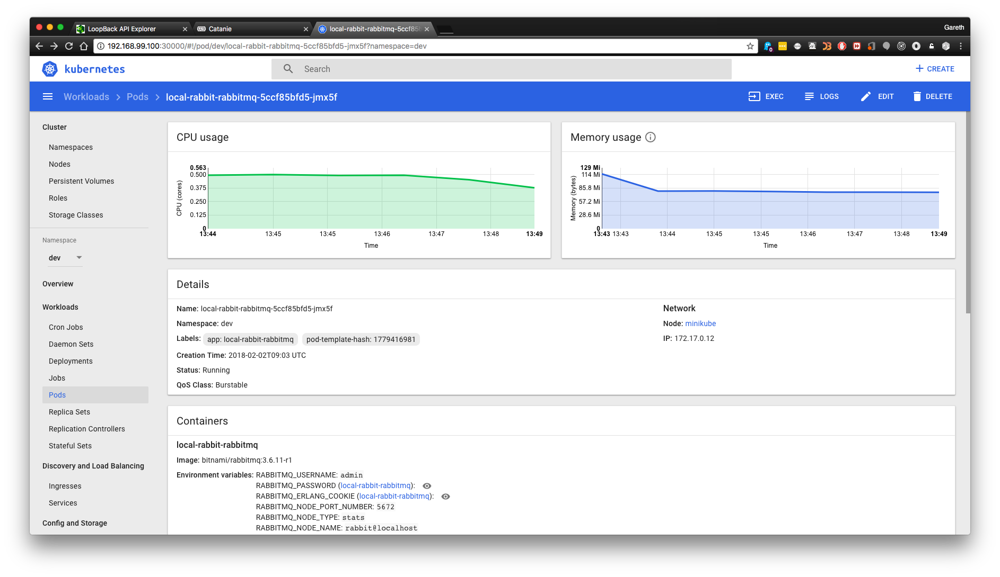

### Kubernetes @ DMSC

Gareth Murphy

ESS DMSC

2018-02-05

---

### What is Kubernetes

- Kubernetes is an open-source system for automating deployment, scaling, and management of containerized applications.
- https://kubernetes.io/
- KubeCon in Cph https://events.linuxfoundation.org/events/kubecon-cloudnativecon-europe-2018/

---

### What do we want to deploy?

- SciCat Data Catalogue
- Make ESS metadata available to users
- Easily findable, accessible, interoperable, reusable (FAIR)
- Open source - https://github.com/ScicatProject

---
### SciCat is not a single app

- Database (MongoDB)
- Web frontend (catanie - Angular based)
- Data catalogue backend (catamel- Automatically generated using loopback)
- Message/job queuing system (currently RabbitMQ -> migrating to Kafka)
- Dataflow interface (Node-Red)

---

### Kubernetes Deployment

- Minikube
- For local testing only
- Working minikube config at http://www.github.com/ScicatProject/localdeploy
- RBAC disabled by default - can renable

---

## Install packages via Helm

- Package manager for Kubernetes
- Equivalent of apt or yum
- Prepackaged k8s deployments available
- https://github.com/kubernetes/charts
- helm install stable/mongodb
- helm install dacat-api-server --name catamel  --set image.tag=$CATAMEL_IMAGE_VERSION --set image.repository=dacat/catamel

---

## Kubernetes

- Deployments
- Services
- Pods (can be groups of containers, we typically use single containers)

---

### MongoDB

- NoSQL storage of metadata, login, jobs
- Database requires persistent storage
- Currently we store on k8s nodes, not a longterm solution

---

### Catanie

- Angular website
- Javascript generated static html
- Data served by catamel
- Viewable on PC, phone etc

---

### Catanie

---

### Node-RED

- Translate metadata from Kafka stream XML to catamel format (JSON)
- can be used to add in extra data cleaning  or processing

---

### Node-RED

---

### Catamel

- Loopback generated API
- Models defined in JSON
- connectivity to authentication server

---

### Catamel

---

### Dashboard Overview

---

### Pods Overview

---

###  Pod CPU & Memory

---

## DEMO

---

"The future offers very little hope for those who expect that our
new mechanical slaves will offer us a world in which we may rest
from thinking." - Norbert Wiener

