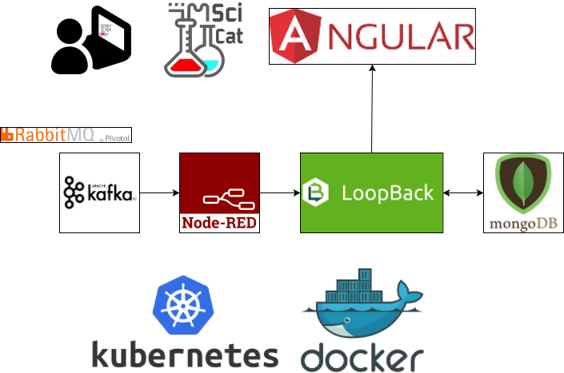
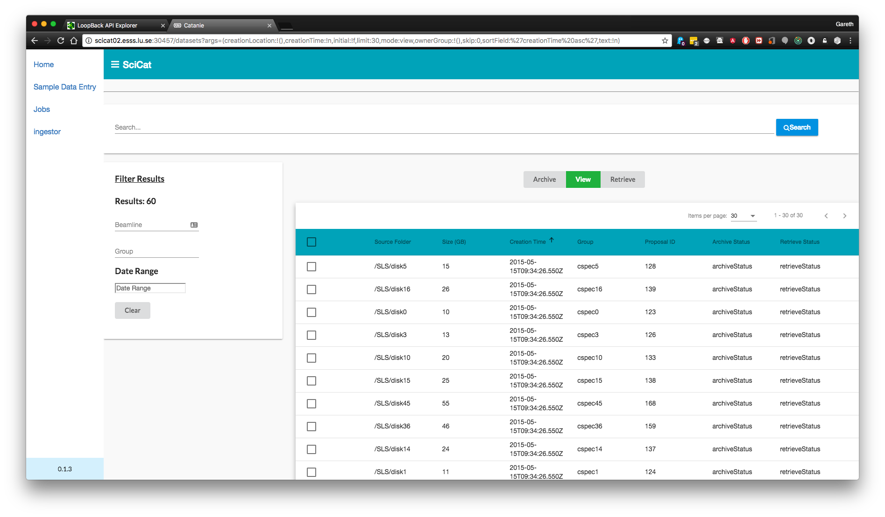
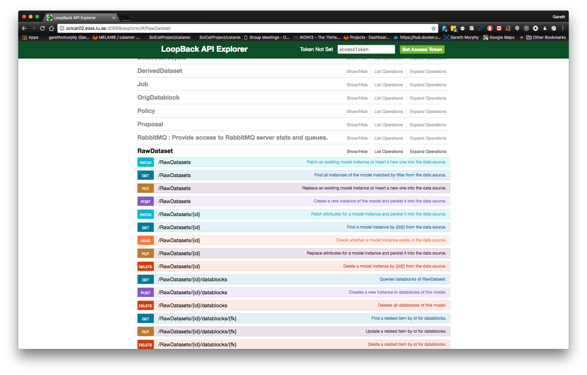

### Kubernetes @ DMSC


Gareth Murphy

European Spallation Source, Lund, Sweden

2018-02-05

---

### What is Kubernetes?

> Kubernetes is an open-source system for automating
> deployment, scaling, and management of containerized
> applications.

- https://kubernetes.io/
- [KubeCon in Cph 2018](https://events.linuxfoundation.org/events/kubecon-cloudnativecon-europe-2018/)


---

### Kubernetes/K8s

- from Greek word κυβερνήτης meaning helmsman/rorsman/timonier/steuermann.
- also root of cybernetics, governor
- Originally developed from Google cluster management system, Borg


---

### What do we want to deploy?


- SciCat Data Catalogue
- developed by in-kind collaborators at PSI (S. Egli, C. Gwilliams)
- Make ESS metadata available to users
- Easily findable, accessible, interoperable, reusable (FAIR)
- Open source - https://github.com/ScicatProject


---
### SciCat is not a single app

- Web frontend (catanie - [angular](http://angular.io) based)
- API service backend (catamel- Automatically generated using IBM's [loopback.io](http://loopback.io)
- Database [MongoDB](https://www.mongodb.com/)
- Message/job queuing system (currently RabbitMQ -> migrating to [Kafka](http://kafka.apache.org))
- Flow-based editor [Node-RED](https://nodered.org/)

---

### SciCat architecture



---

### Kubernetes Deployment

- Can test kubernetes deployment using minikube, wihout installing a full cluster
- Try it yourself!
- Working minikube config at http://www.github.com/ScicatProject/localdeploy
- RBAC disabled by default - can re-enable


---

### Kubernetes architecture


---

## Kubernetes

- Applications are deployed to "pods", which are made available using services, which are accessed using ingress
- For each of the 5+ services we need to configure:
    1. Deployments
    2. Services
    3. Pods (can be groups of containers, we typically use single containers)
    4. Ingress
- for each of 5 microservices, 4 configurations = 20 config files


---

## Install packages via Helm

- Helm can short circuit this process
- Package manager for Kubernetes
- Equivalent of apt or yum
- Prepackaged k8s deployments available
- https://github.com/kubernetes/charts

---

## Install packages via Helm
- A helm chart includes template .yaml files for deployment,
service etc.
```
helm install stable/mongodb
```
- Can use helm to install from custom Docker image
```
helm install catamel --name catamel  \
 --set image.tag=$IMAGEVERSION  \
 --set image.repository=dacat/catamel
```
---

### MongoDB

- NoSQL storage of metadata, login, jobs
- Database requires persistent storage
- Currently we store on k8s nodes, not a longterm solution


---

### Catanie

- Angular website
- Javascript generated static html
- Data served by catamel
- Viewable on PC, phone etc

---

### Catanie



---

### Node-RED

- Translate metadata from Kafka stream XML to catamel format (JSON)
- Can be used to add in extra data cleaning  or processing


---

### Node-RED


---

### Catamel

- Metadata server
- Loopback generated API
- Models defined in JSON
- Also provides connectivity to authentication server(s)


---

### Catamel



---

### Dashboard Overview


---

### Pods Overview


---

###  Pod CPU & Memory


---

### Deployment of scicat

- still outstanding:
- Ingress
- persistent storage
- Active directory

---

## Conclusion

- SciCat on Kubernetes will be able to provide metadata services for ESS users needs


---

> The future offers very little hope for those who
> expect that our new mechanical slaves will offer
> us a world in which we may rest from thinking.

Norbert Wiener


